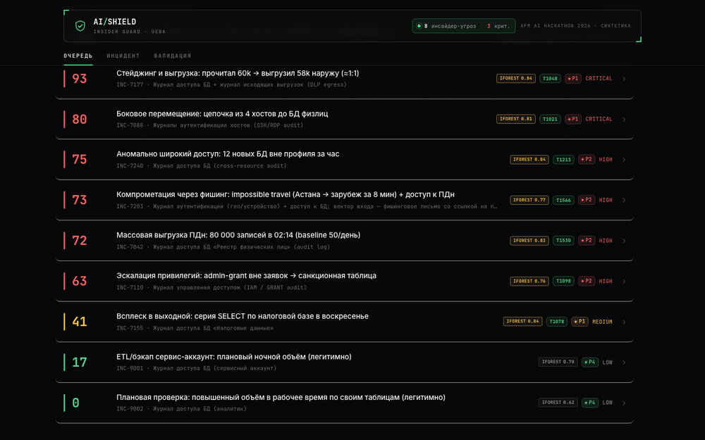
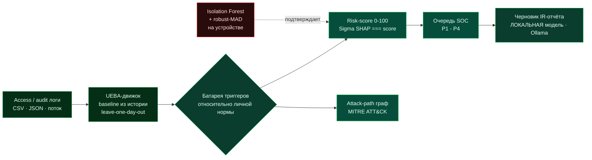
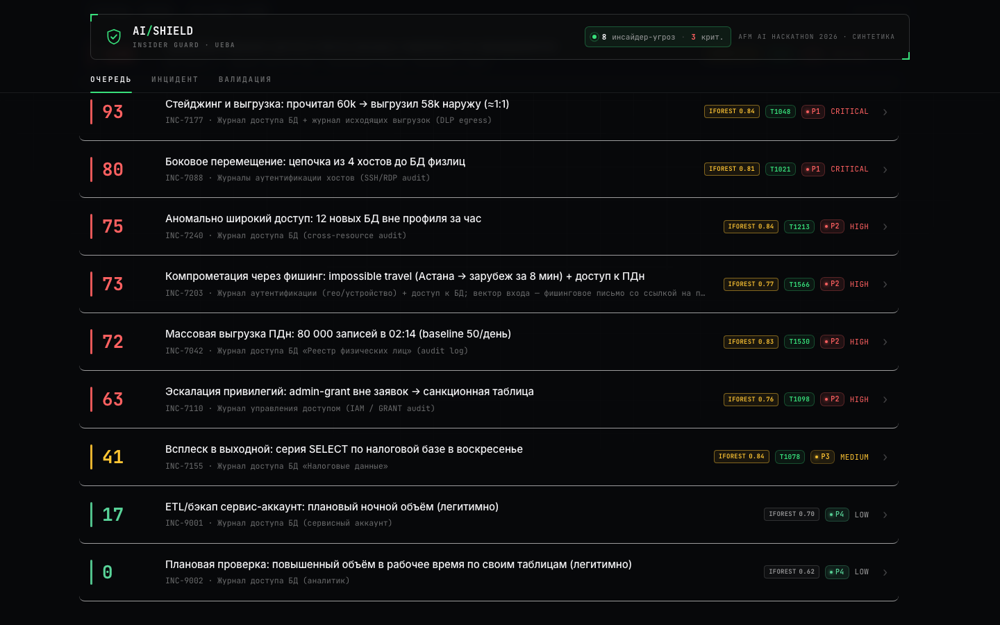
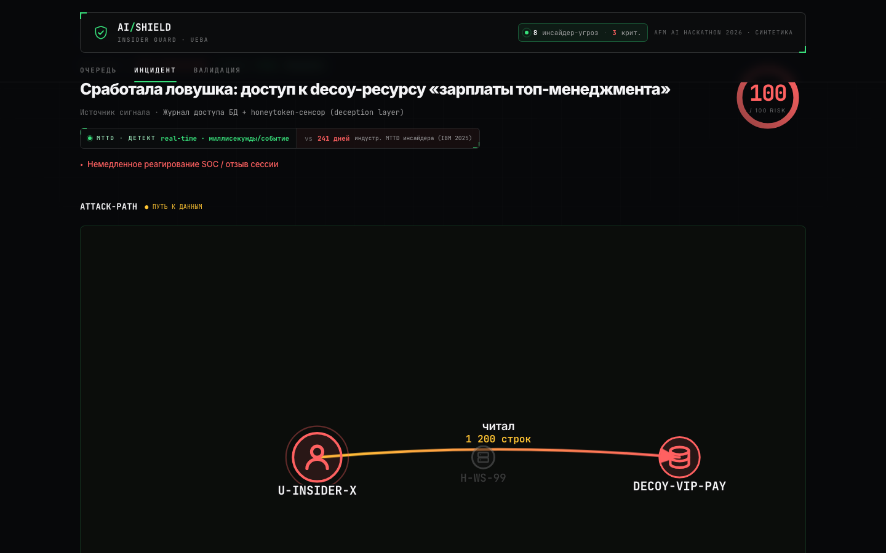
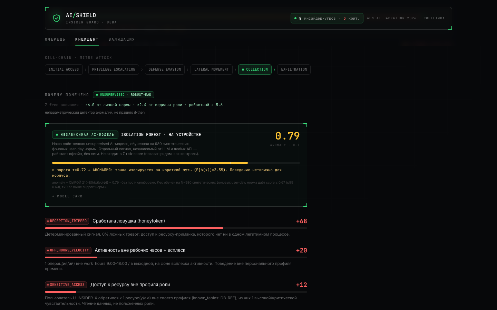
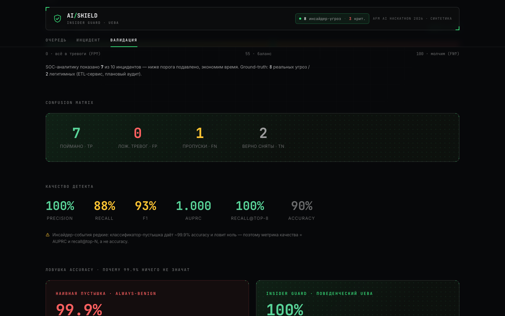
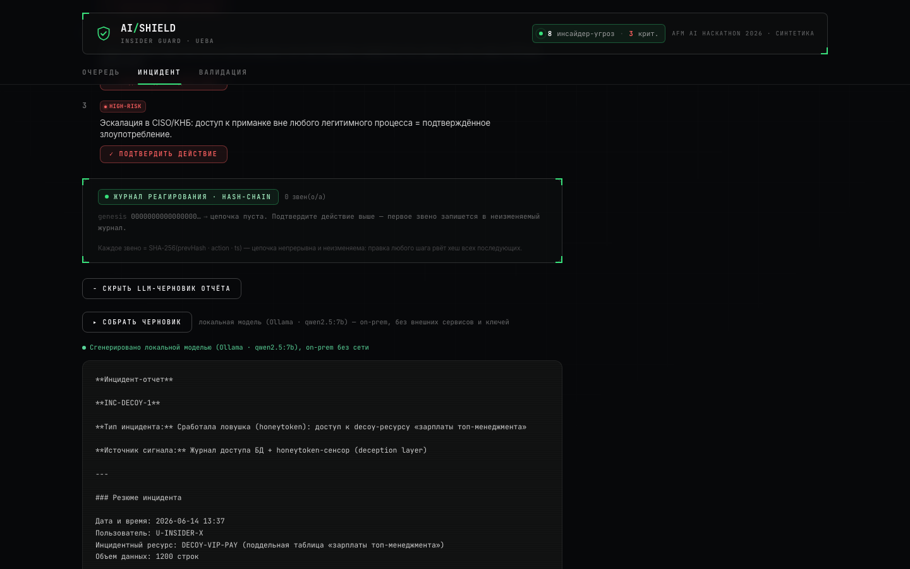

<div align="center">


<p>
<a href="https://insider-guard-demo-production.up.railway.app"></a>
&nbsp;
<a href="https://insider-guard.vercel.app"></a>
</p>

<p>


</p>


</div>

> **DLP видит периметр. SIEM видит сигнатуры. Insider Guard видит ПОВЕДЕНИЕ.**
> Поток access/audit-логов → детект инсайдера и компрометации аккаунта по отклонению от
> поведенческого baseline пользователя (**UEBA**) → **человекочитаемое объяснение, почему помечено**
> + рекомендация реагирования (IR-плейбук) + **приоритизированная очередь** инцидентов для SOC.
> Превенция следующей утечки 16,3 млн ИИН, а не разбор постфактум.

<div align="center">

<br/>
<sub>⚠️ Всё на экране — <b>синтетика, 0 реальных ИИН</b>. Privacy-by-design: псевдонимизация · per-user baseline · human-in-the-loop.</sub>
</div>

---

## 🎯 Зачем это нужно сейчас

**Утечка 16,3 млн записей РК (июнь 2025) — это был инсайдер с авторизованным доступом, а не взлом периметра.**
Файрвол, антивирус и DLP такое не ловят: запрос к базе выглядит «легально». Единственное, что выдаёт
инсайдера, — **аномалия его собственного поведения**: выгрузка в десятки раз больше нормы, ночью, по таблице ПДн.

Контекст (IBM 2025): malicious insider — самый дорогой вектор (**$4,92M**), средний MTTD — **241 день**.
Insider Guard сжимает эти 241 день до **секунд**: движок считает норму сам и поднимает злоумышленника в топ очереди.

## 🧠 Что это

Дашборд SOC / инцидент-аналитика. На вход — **access/audit-логи** (журналы доступа к БД, аутентификации
хостов, IAM-grant'ов, исходящих выгрузок). На выход — **приоритизированная очередь инцидентов** с risk-score
0–100, **графом доступа**, **объяснением по факторам** (SHAP-подобная декомпозиция, где Σ вкладов === score)
и черновиком IR-отчёта.

Детект строится не на сигнатурах атаки, а на **отклонении от персонального baseline самого пользователя**:
объём, время, широта доступа, привилегии, гео/устройство. Инструмент **не заменяет** аналитика, а **сортирует
его работу** (самое опасное наверх) и **объясняет каждое решение**, чтобы человек мог проверить.

## 🏗 Архитектура



## 🤖 AI на устройстве — ноль внешних API

Каждая модель в продукте **локальна**. Продукт не делает ни одного внешнего сетевого вызова — отключи
интернет, и детект, score, SHAP, граф, метрики и даже черновик отчёта работают полностью.

| Слой | Что это | Где |
|---|---|---|
| **Isolation Forest** | Полноценный лес (Liu/Ting/Zhou, ICDM 2008), реализован с нуля на чистом JS, **0 ML-зависимостей**. Обучен на ~980 синтетических фоновых user-day; сырой anomaly `2^(−E[h]/c)`, виден в UI (чип `iForest` + MODEL CARD). | `index.html` → `buildIForest` |
| **Robust modified z-score (MAD)** | Unsupervised-аномалия «×N от своей нормы И ×M от медианы роли», устойчивая к выбросам, без меток. | `server/lib/fmt.js` · `server/engine.js` |
| **Honeytoken / DECEPTION_TRIPPED** | Детерминированный 0-FP слой поверх вероятностной AI: касание decoy → score 100 по факту (MITRE T1546). | `server/engine.js` |
| **IR-отчёт (LLM)** | Нарратив черновика отчёта генерит **локальная модель через Ollama** (`qwen2.5:7b`), on-prem, без ключа. Никогда не считает score — только текст поверх готовых фактов. Mock-шаблон — offline-fallback. | `server/lib/llm.js` · `server/report.js` |

> Источник вердикта (Σ===score) — **детерминированные UEBA-эвристики**, выбранные осознанно под imbalance ~10⁻⁶
> и аудируемость. AI-модели работают **рядом** как независимые сигналы; LLM — строго поверх посчитанного результата
> (анти-паттерн «LLM as source of truth» исключён архитектурно).

## ✨ Возможности

- **UEBA с computed baseline** — норма каждого пользователя считается из его истории (leave-one-day-out), а не хардкодится.
- **Exact-attribution (Σ SHAP === score)** — аддитивная декомпозиция «почему помечено», сумма вкладов бит-в-бит равна score.
- **Attack-path граф + Play-скраббер** — DFS-путь бокового перемещения ≥3 хоста, разворачивающийся во времени.
- **MITRE ATT&CK-бейджи** — каждый триггер маппится на технику (T1021/T1048/T1074/T1078/T1098/T1213/T1530/T1566).
- **Kill-chain ribbon** — тактики атаки от Initial Access до Exfiltration.
- **SHA-256 tamper-seal** — криптографическая печать досье; правка одного числа → `INTEGRITY BROKEN`.
- **Tiered-autonomy реагирование** — действия AUTO / APPROVE / HIGH-RISK + append-only hash-chain audit-log.
- **Честные rare-event метрики** — recall@topN / AUPRC / precision vs наивный DLP-порог, **НЕ accuracy**.
- **Загрузка своего CSV** — baseline считается из ваших данных без предразметки (drag-and-drop или `POST /api/ingest`).
- **Real-time MTTD** — детект по потоку логов за секунды (vs 241 день среднего MTTD по IBM 2025).

## 🖼 Скриншоты

<table>
<tr>
<td width="50%"><br/><div align="center"><b>Очередь триажа</b> · risk-score · MITRE · iForest</div></td>
<td width="50%"><br/><div align="center"><b>Attack-path граф</b> · кто → ресурс → хост</div></td>
</tr>
<tr>
<td width="50%"><br/><div align="center"><b>Isolation Forest + SHAP</b> · объяснимость</div></td>
<td width="50%"><br/><div align="center"><b>Валидация</b> · TP/FP · AUPRC · recall@top-N</div></td>
</tr>
<tr>
<td colspan="2"><br/><div align="center"><b>Черновик IR-отчёта</b> · сгенерирован <b>локальной моделью (Ollama · qwen2.5:7b)</b>, on-prem без сети</div></td>
</tr>
</table>

## 🚀 Быстрый старт

```bash
npm install          # express, multer, csv-parse, nanoid и т.д.
npm run seed         # корпус 40 пользователей × 30 дней + размеченные инциденты + benign-контроли
npm start            # http://localhost:3000
```

Открыть `http://localhost:3000`. Health: `http://localhost:3000/api/health`.

**Локальная модель для отчёта (опционально):** поставить [Ollama](https://ollama.com), затем
```bash
ollama pull qwen2.5:7b     # один раз; затем демон уже работает в фоне
```
Если Ollama не запущена — черновик отчёта детерминированно падает в mock-шаблон, остальное работает.

**On-prem за периметром (один образ Node + Ollama):**
```bash
docker build -t insider-guard .
docker run -p 3000:3000 -v ig-models:/root/.ollama insider-guard
```

## 🔌 API

| Method | Path | Назначение |
| --- | --- | --- |
| `GET` | `/api/health` | liveness `{ ok, db, version }` |
| `POST` | `/api/ingest` | upload лога → запуск движка → новый датасет |
| `GET` | `/api/incidents` | очередь триажа (score desc) |
| `GET` | `/api/incidents/:id` | деталь: граф + SHAP + baseline + playbook |
| `POST` | `/api/report/:id` | IR-отчёт через локальную модель (Ollama), mock-fallback |
| `POST` | `/api/report/draft` | прокси для in-browser демо → локальная Ollama |
| `GET` | `/api/metrics?threshold=` | confusion / precision / recall / AUPRC + naive-DLP |

Полный контракт + примеры payload — [`docs/contract.md`](docs/contract.md).

## 🏅 Соответствие критериям трека (AI Shield)

| # | Критерий | Чем закрыт |
|---|---|---|
| 1 | Актуальность / инновационность + обоснованность AI | якорь 16,3 млн · UEBA по личной норме · Σ SHAP === score |
| 2 | AI-модель, независимая от иных сервисов | две свои unsupervised-модели на устройстве + локальная LLM для отчёта · **0 внешних API** |
| 3 | Информационная безопасность + этика | OWASP/STRIDE · синтетика · privacy-by-design · human-in-the-loop · tamper-seal |
| 4 | Практическая реализуемость + масштабируемость | живой MVP · 12-полевой контракт · ~50 строк адаптера на источник · on-prem Docker |
| 5 | Качество презентации и техзащиты | отполированный UI · валидация (порог 55: TP=7/FP=0/FN=1/TN=2, recall@top-8 100%) |

Подробный разбор с пруфами (файл/эндпоинт/строка) — [`CRITERIA.md`](CRITERIA.md).

## 📚 Документация

- [`SUBMISSION.md`](SUBMISSION.md) — одностраничник для жюри
- [`CRITERIA.md`](CRITERIA.md) — соответствие 5 официальным критериям
- [`docs/contract.md`](docs/contract.md) — контракт API + формат ingest
- [`SECURITY.md`](SECURITY.md) — threat-model (OWASP/STRIDE)
- [`DEMO-SCRIPT.md`](DEMO-SCRIPT.md) — поминутный сценарий защиты

## ⚖️ Честные ограничения

- Источник вердикта — **детерминированные UEBA-эвристики** (не обученный XGBoost/autoencoder): осознанный выбор под imbalance 10⁻⁶ и аудируемость. Рядом работают две настоящие unsupervised AI-модели.
- Данные **синтетические**, подобраны так, чтобы каждая типология чисто срабатывала; benign-контроли добавлены специально против «детектора-перестраховщика». На синтетике типологии сепарабельны (отсюда AUPRC=1.000) — **на реальном логе цифры будут ниже, методология (leave-one-day-out) та же.**
- «Фишинг» покрыт косвенно: детект ловит **пост-фишинговую компрометацию** учётки (impossible travel, новый гео/устройство + аномальный доступ), а не сами письма.

<div align="center">


<sub>AFM AI Hackathon 2026 · трек <b>AI Shield</b> · защита данных / антихакинг · Алматы, 24–25 июня · MIT License</sub>

</div>
